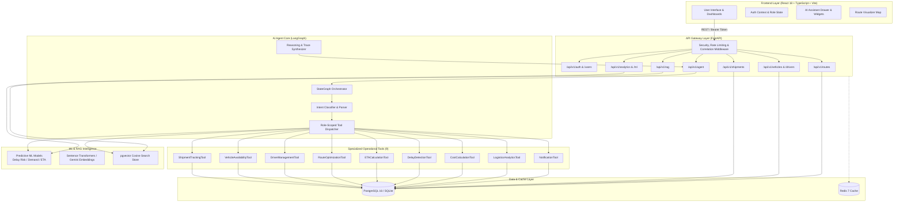
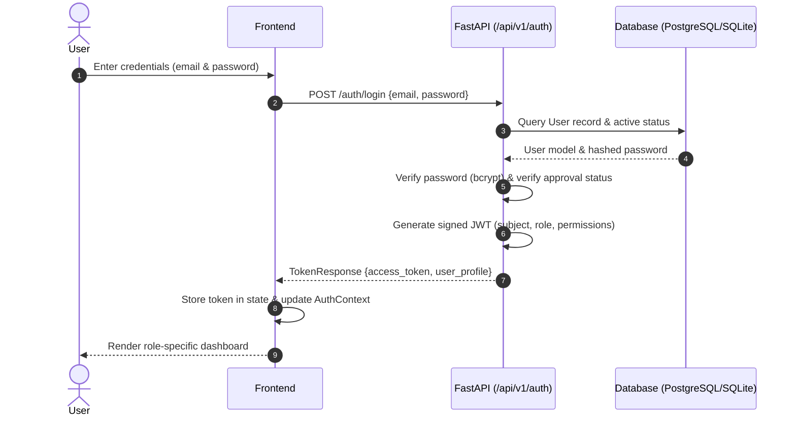
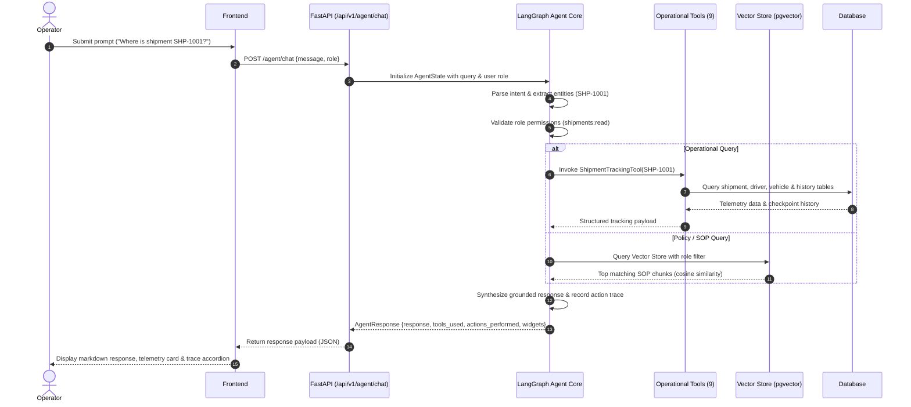
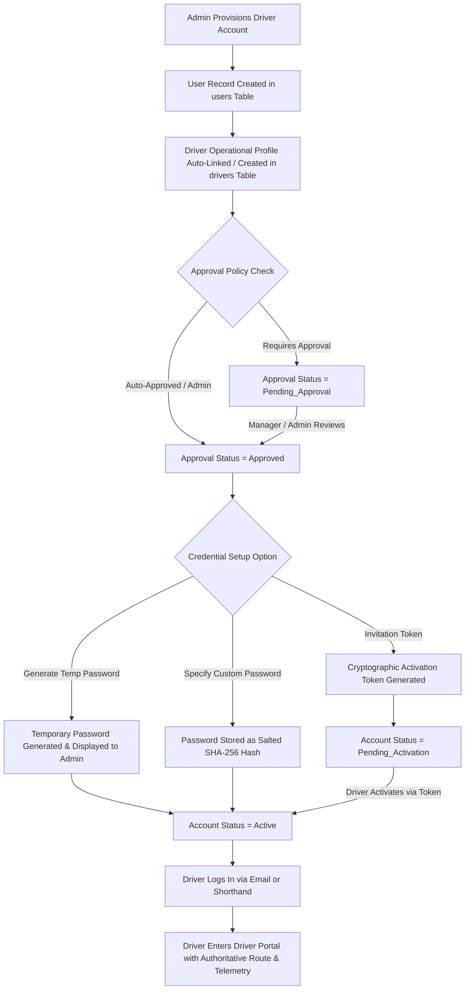
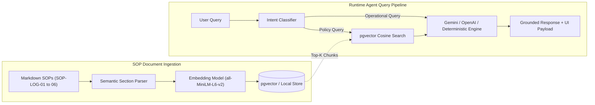
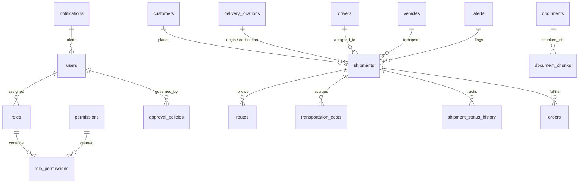

<div align="center">

# 🚚 LogiAgent

**AI-Powered Logistics Management and Intelligent Operations Platform**

[](https://fastapi.tiangolo.com)
[](https://www.python.org/)
[](https://github.com/langchain-ai/langgraph)
[](https://react.dev/)
[](https://www.typescriptlang.org/)
[](https://vitejs.dev/)
[](https://tailwindcss.com/)
[](https://www.postgresql.org/)
[](https://supabase.com/)
[](https://redis.io/)
[](https://www.docker.com/)

<p align="center">
  <a href="#-project-overview">Overview</a> •
  <a href="#-key-features">Key Features</a> •
  <a href="#%EF%B8%8F-system-architecture">Architecture</a> •
  <a href="#-data-flow">Data Flow</a> •
  <a href="#-role-based-access-control-rbac">RBAC</a> •
  <a href="#-ai--rag-architecture">AI & RAG</a> •
  <a href="#%EF%B8%8F-database-architecture">Database</a> •
  <a href="#-quick-start">Quick Start</a>
</p>

> 🚀 **Live Demo:** Deployment pending
>
> 📚 **API Documentation:** `http://localhost:8000/docs` (Swagger UI) & `http://localhost:8000/redoc` (ReDoc)
>
> 💻 **GitHub Repository:** [https://github.com/syedzaid9/logiagent](https://github.com/syedzaid9/logiagent)

</div>

---

## 📖 Table of Contents
1. [Project Overview](#-project-overview)
2. [Key Features](#-key-features)
3. [Visual Showcase](#-visual-showcase)
4. [System Architecture](#%EF%B8%8F-system-architecture)
5. [Data Flow](#-data-flow)
6. [Role-Based Access Control (RBAC)](#-role-based-access-control-rbac)
7. [AI & RAG Architecture](#-ai--rag-architecture)
8. [Database Architecture](#%EF%B8%8F-database-architecture)
9. [Project Structure](#-project-structure)
10. [Technology Stack](#%EF%B8%8F-technology-stack)
11. [Docker Architecture](#-docker-architecture)
12. [Quick Start & Local Setup](#-quick-start)
13. [Testing & Verification](#-testing--verification)

---

## 🎯 Project Overview

Logistics managers, dispatchers, fleet directors, and drivers operate in high-friction environments requiring data from disparate systems: live GPS trackers, driver Hours of Service (HOS) logs, vehicle payload constraints, route delay predictions, and dense standard operating procedure (SOP) compliance manuals.

**LogiAgent** solves this operational fragmentation by integrating a full-featured logistics telemetry platform with an autonomous **LangGraph-driven AI operations agent**. Rather than relying on static dashboards or ungrounded generative AI, LogiAgent connects natural language queries directly to live database telemetry, predictive machine learning models, and a vector-indexed compliance knowledge base.

```
Logistics Operators (Manager | Dispatcher | Fleet | Driver | Analyst | Ops | Admin)
                                      │
                                      ▼
             React 18 + TypeScript + Vite + Tailwind CSS Frontend
                                      │
                                HTTPS / REST
                                      │
                                      ▼
                      FastAPI Backend & Security Gateway
                                      │
                                      ▼
                     LogiAgent LangGraph Reasoning Core
                                      │
             ┌────────────────────────┼────────────────────────┐
             ▼                        ▼                        ▼
     9 Operational Tools      RAG Knowledge Base      ML Predictors
  (Tracking, Fleet, Routes,    (pgvector SOPs)     (Delay Risk, ETA,
   HOS, Costs, Analytics)                            Demand Forecast)
             │                        │                        │
             └────────────────────────┼────────────────────────┘
                                      ▼
               PostgreSQL 16 (pgvector) / SQLite + Redis Cache
```

### Core Problems Solved
- **Real-Time Visibility:** Instant multi-parameter tracking across 36 pre-seeded shipments, 12 vehicles, and 12 commercial drivers spanning 15 distribution centers.
- **Explainable Anomaly & Delay Prediction:** Machine learning models for delay classification, dynamic ETA calculation, and cost optimization.
- **Grounded Compliance & Policy Retrieval:** Semantic vector search across 6 company SOP documents (cold chain, detention charges, driver safety, failed deliveries, HAZMAT).
- **Zero-Hallucination Operations:** Autonomous tool-calling workflow with deterministic fallback execution and full step-by-step reasoning traces.

---

## ✨ Key Features

### 🔐 Authentication & Access Governance
- **JWT-Based Authentication:** Secure token generation with password hashing via passlib (`bcrypt`).
- **Granular RBAC System:** 7 distinct system roles with individual permissions mapping to API routes and UI views.
- **Account Lifecycle & Approval Hierarchy:** User invitation token workflow, activation, approval requirements per role, and suspension safeguards.
- **Security Middlewares:** Request correlation tracking (`X-Request-ID`), structured logging, security headers (CSP, HSTS, X-Frame-Options), and sliding-window rate limiting.

### 📦 Shipment Management & Live Tracking
- **Lifecycle Status Tracking:** Full status progression (`Created` → `Dispatched` → `In Transit` → `Out for Delivery` → `Delivered` / `Delayed` / `Failed Delivery` / `Cancelled`).
- **Real-Time Telemetry:** Live coordinates, remaining distance, speed, temperature status (cold chain), and estimated vs. actual timestamps.
- **Audit History Trail:** Immutable timeline logging checkpoints, status updates, and responsible entities.
- **CRUD & Filtering:** Filter by status, destination hub, delay severity, carrier, and assigned driver.

### 🚛 Fleet & Driver Telemetry
- **Vehicle Roster & Capacity Matching:** Track payload capacity (kg), volume ($m^3$), fuel levels, maintenance states, and current driver pairings across multiple vehicle types (Dry Van, Reefer, Flatbed, Box Truck, Sprinter).
- **Driver HOS & Compliance Management:** Track CDL license classes, DOT Hours-of-Service remaining (driving vs. on-duty limits), safety ratings, and availability.

### 🗺️ Route Intelligence & Corridor Optimization
- **Interactive Route Visualizer:** Continental waypoint planning, polyline rendering, and highway corridor visualization.
- **Dynamic ETA Calculation:** Transit calculations factoring in average speed, traffic slowdown factors, and mandatory rest stops.
- **Cost Modeling Engine:** Algorithmic calculation of trip costs including fuel consumption, driver hourly wages, toll gates, and maintenance allocations.

### 📊 Predictive ML & Operations Analytics
- **Delay Risk Classifier:** Multi-factor delay risk scoring based on distance, traffic conditions, weather factors, and current transit variance.
- **Demand Volume Forecaster:** 7-day predictive time-series volume forecasting with confidence intervals.
- **Logistics KPI Dashboard:** Real-time metrics for on-time delivery rate, fleet capacity utilization, active exceptions, and financial spend per kilometer.

### 🤖 LangGraph AI Operations Agent
- **Intent Parsing & Parameter Extraction:** Automatic identification of shipment codes (`SHP-XXXX`), vehicle IDs (`TRK-XXX`), driver codes (`DRV-XXX`), weights, and query intents.
- **Multi-Tool Orchestration:** Autonomous execution of 9 specialized logistics tools with role-scoped permission guards.
- **Transparent Execution Trace:** Returns structured UI cards alongside a complete step-by-step trace of actions performed and tool execution latencies.
- **Dual-Engine Architecture:** Integrates Gemini and OpenAI LLMs with an automatic deterministic fallback engine for zero-dependency local operation.

### 📜 RAG Policy Knowledge Base
- **Vector-Indexed SOPs:** 6 complete Standard Operating Procedures indexed via dense embeddings into Supabase `pgvector` / local vector storage.
- **Role-Scoped Policy Retrieval:** Cosine similarity search with authorization filtering so drivers and dispatchers only retrieve authorized documentation.

### 🔔 Event-Driven Notification & Alert Center
- **Alert Lifecycle Management:** Alert generation, status progression (`active` → `acknowledged` → `resolved`), and deduplication indexing.
- **Multi-Channel Dispatch:** Simulated multi-channel alert delivery (In-App, Email, SMS, Push) filtered by severity (`LOW`, `MEDIUM`, `HIGH`, `CRITICAL`).

---

## 📸 Visual Showcase

> 📸 **Screenshots:** Application interface screenshots can be added here following deployment or demo environment capture.

LogiAgent provides a comprehensive user interface built with React, TypeScript, and Tailwind CSS:

1. **Role-Specific Dashboards:** 7 tailored cockpit views for Admin, Logistics Manager, Dispatcher, Fleet Manager, Driver, Analyst, and Operations Team.
2. **Interactive AI Assistant:** Slide-out conversational panel featuring quick prompts, markdown output, live execution traces, and structured telemetry cards.
3. **Route Visualizer:** Map visualization showing route corridors, traffic indicators, and turn-by-turn waypoints.
4. **Shipment Command Center:** Searchable, sortable freight grid with real-time status badges, delay alerts, and detailed modal dialogs.
5. **Fleet & Driver Roster:** Asset management grid with capacity utilization gauges, HOS compliance meters, and vehicle health metrics.
6. **Policy Explorer:** Semantic SOP document viewer with instant vector query search and source citations.
7. **System Settings:** Administrative configuration for SLA targets, rate limits, notification preferences, and AI provider selection.

---

## 🏗️ System Architecture



### Component Breakdown
- **Presentation Layer (`/frontend`):** Built with React 18, Vite, TypeScript, and Tailwind CSS. Features modular views, role-based conditional rendering via `PermissionGate`, Recharts data visualizations, and an embedded AI command drawer.
- **Backend API Gateway (`/backend/app`):** FastAPI application with automatic OpenAPI docs, Pydantic v2 validation, passlib security, and structured request logging.
- **LangGraph Agent Engine (`/backend/app/agents`):** StateGraph workflow managing conversational state, intent resolution, tool execution, and grounded answer synthesis.
- **Specialized Tool Suite (`/backend/app/tools`):** 9 modular tool implementations executing direct database queries, telemetry math, and automated alerts.
- **Machine Learning Layer (`/backend/app/ml`):** Python-based predictive algorithms for transit delay classification, route efficiency scoring, and demand forecasting.
- **RAG Subsystem (`/backend/app/rag`):** Vector search pipeline with chunking, dense vector embeddings (`all-MiniLM-L6-v2`), and cosine distance matching via Supabase `pgvector`.
- **Persistence Layer (`/backend/app/models`):** SQLAlchemy 2.0 ORM models supporting PostgreSQL 16 (production) and SQLite (local zero-dependency development).

---

## 🔄 Data Flow

### 1. User Authentication Flow


### 2. Autonomous AI Agent Query Flow


---

## 👥 Role-Based Access Control (RBAC)

LogiAgent implements a multi-tier RBAC system with 7 operational personas:

| Role | Description | Key Permissions | Default Dashboard |
|---|---|---|---|
| **Admin** | Full system governance, security policies, and user lifecycle. | `*` (Full unrestricted system permissions) | **Admin Governance Cockpit** |
| **Logistics Manager** | End-to-end supply chain operations, approvals, and executive analytics. | `shipments:manage`, `vehicles:manage`, `drivers:manage`, `routes:manage`, `analytics:read_all`, `agent:full_access` | **Logistics Manager Dashboard** |
| **Dispatcher** | Active load dispatch, driver scheduling, and corridor optimization. | `shipments:manage`, `vehicles:read`, `drivers:read`, `routes:optimize`, `analytics:read_limited`, `agent:full_access` | **Dispatcher Operations Cockpit** |
| **Fleet Manager** | Vehicle asset lifecycle, maintenance logs, and driver compliance. | `vehicles:manage`, `drivers:manage`, `shipments:read_all`, `telemetry:read`, `analytics:read_all`, `agent:full_access` | **Fleet & Asset Dashboard** |
| **Driver** | Commercial freight operator with strictly self-scoped access. | `shipments:read_own`, `vehicles:read_own`, `drivers:read_own`, `routes:read_own`, `agent:driver_restricted` | **Driver Mobile/Route Portal** |
| **Analyst** | Read-only business intelligence, SLA trends, and cost modeling. | `analytics:read_all`, `analytics:export`, `shipments:read_all`, `routes:read_all`, `agent:full_access` | **Supply Chain Analytics Hub** |
| **Operations Team** | Terminal logistics personnel with operational read/update access. | `shipments:read_all`, `shipments:update`, `vehicles:read_all`, `drivers:read_all`, `agent:full_access` | **Operations Terminal Dashboard** |

### Backend & Frontend Enforcement
- **Backend Protection:** Endpoints are guarded via `has_permission(role, permission)` dependencies and database-level user lookup.
- **Frontend Protection:** Components use `<PermissionGate permission="...">` wrappers to conditionally render UI controls, action buttons, and navigation tabs.

### 🚛 Admin-Created Driver Account Workflow

When an administrator provisions a commercial driver account through the **User Accounts & RBAC Management** interface (`/users/provision`), the system orchestrates a synchronized authentication and operational lifecycle:



#### Step-by-Step Lifecycle:

1. **Admin Creates Driver:**
   - The administrator inputs the driver's full name, email, and role (`Driver`).
   - The administrator chooses between linking an existing driver profile or allowing the system to automatically generate a dedicated operational profile with commercial license defaults and telemetry hooks.
   - The administrator selects the initial authentication method:
     - **Generate Temporary Password:** Immediate 1-click password generation for direct operator sign in.
     - **Specify Initial Password:** Explicit password assignment.
     - **Invitation Token:** Cryptographic token valid for 7 days.

2. **Driver Profile Linkage:**
   - The backend automatically associates `user.driver_id` with the operational `Driver` record in the `drivers` table.
   - This ensures the driver is never orphaned without an operational profile and eliminates telemetry loading errors upon first login.

3. **Account & Approval Governance:**
   - **Account Status:** `Active`, `Pending_Activation`, `Suspended`, or `Deactivated`.
   - **Approval Status:** `Approved`, `Pending_Approval`, or `Rejected`.
   - Accounts requiring higher-authority authorization remain in the pending queue until approved by an authorized manager or administrator.

4. **Credential Setup & Administrator Reset:**
   - Administrators can reset or configure credentials anytime from the RBAC table by clicking the **Key Icon (Set/Reset Password)** action button.
   - The administrator can either generate a new temporary password on the fly or specify a custom password.
   - The administrator can also click the **Mail Icon (Reissue Invitation)** to generate a fresh activation token.

5. **Driver Login & Portal Access:**
   - The driver signs in at the login screen using their work email (or shorthand username) and established password.
   - Upon authentication, the backend issues a role-scoped JWT containing `sub` (User ID), `role` (`Driver`), and `driver_id`.
   - The driver portal instantly loads live route assignments, active shipments, HOS compliance gauges, and GPS corridor telemetry.

---

## 🤖 AI & RAG Architecture

LogiAgent's intelligence layer combines LangGraph state management with dense vector retrieval:



### Indexed Standard Operating Procedures (SOPs)
1. **`SOP-LOG-01`**: General Logistics Operations, Service Level Agreements (SLAs), and Proof of Delivery.
2. **`SOP-LOG-02`**: Failed Delivery and Exception Handling Protocol (15-min hold, 24h grace period, detention billing).
3. **`SOP-LOG-03`**: Cold Chain Management & Temperature Compliance (+2°C to +8°C requirements, excursion workflows).
4. **`SOP-LOG-04`**: Commercial Driver Hours of Service (HOS) & DOT Safety Regulations (11h driving limit, 14h duty window).
5. **`SOP-LOG-05`**: Detention, Demurrage & Accessorial Surcharges ($85/hr dry van, $110/hr reefer, 2h free time).
6. **`SOP-LOG-06`**: Hazardous Materials (HAZMAT) Transport Protocol (49 CFR compliance, CDL endorsements).

### Dual LLM Engine with Deterministic Fallback
- **Cloud LLM Support:** Native integration with Google Gemini (`gemini-1.5-pro` / `gemini-1.5-flash`) and OpenAI (`gpt-4o` / `gpt-4o-mini`).
- **Deterministic Fallback Engine:** When running offline or without API keys, LogiAgent automatically uses a local rule-and-template synthesis engine to ensure zero downtime and deterministic test passes.

---

## 🗄️ Database Architecture

LogiAgent uses SQLAlchemy 2.0 with migration scripts supporting **PostgreSQL 16** (with `pgvector`) and **SQLite** for zero-setup local execution.



### Core Database Entities
- `users`: User profiles, email, hashed credentials, role references, activation tokens, approval states.
- `roles` & `permissions`: RBAC catalog and many-to-many permission grants (`role_permissions`).
- `approval_policies`: Role-based approval requirements and designated approver role chains.
- `customers`: Enterprise customer profiles, accounts, and contact details.
- `delivery_locations`: 15 logistics distribution centers, warehouses, and customer hubs with GPS coordinates.
- `vehicles`: Fleet vehicles, models, types, payload capacity (kg), volume ($m^3$), fuel levels, and coordinates.
- `drivers`: Commercial drivers, CDL license classes, remaining HOS driving/duty hours, safety ratings, and assigned vehicles.
- `shipments`: 36 freight shipments (`SHP-1001` to `SHP-1036`), status, origin/destination hubs, weight, ETA, delay minutes, risk levels.
- `routes`: Polyline coordinates, planned vs. actual distance/duration, traffic condition, waypoints JSON.
- `transportation_costs`: Distance, fuel costs, labor wages, tolls, maintenance, and total cost per trip.
- `shipment_status_history`: Checkpoint audit logs with status timestamps and notes.
- `alerts`: Operational exceptions (`DELAY_RISK`, `HOS_VIOLATION`, `TEMPERATURE_EXCURSION`), deduplication keys, status (`active`, `acknowledged`, `resolved`).
- `notifications`: User notification queue across Email, SMS, Push, and In-App channels.
- `documents` & `document_chunks`: RAG vector catalog storing section text, metadata, and 384-dimensional vector embeddings.
- `system_settings`: Organization parameters, SLA targets, rate limit settings, and security controls.

---

## 📁 Project Structure

```text
logiagent/
├── architecture/                   # System architecture specifications & documentation
│   └── ARCHITECTURE.md             # Complete architecture specification
├── backend/                        # FastAPI Backend & AI Services
│   ├── app/
│   │   ├── agents/                 # LangGraph Agent Core, state, prompts & LLM factory
│   │   ├── api/                    # REST routers (v1: auth, shipments, fleet, routes, agent, etc.)
│   │   ├── core/                   # Config, database engine, logging, security, rate limiter, middleware
│   │   ├── data/                   # Database seeding scripts & initial datasets
│   │   ├── ml/                     # Predictive ML models (Delay Risk, Demand, ETA, Cost)
│   │   ├── models/                 # SQLAlchemy 2.0 ORM database models
│   │   ├── rag/                    # RAG document loader, embeddings & pgvector store
│   │   ├── schemas/                # Pydantic v2 request/response schemas
│   │   ├── services/               # Core business services (Analytics, Cost, Traffic, Risk)
│   │   └── tools/                  # 9 LangGraph operational tools
│   ├── data/migrations/            # SQL migration scripts (RBAC, performance, AI intelligence)
│   ├── tests/                      # Automated test suite (101 unit & integration tests)
│   ├── Dockerfile                  # Production backend container definition
│   ├── requirements.txt            # Python dependencies
│   ├── main.py                     # Direct backend entrypoint
│   └── verify_all_scenarios.py     # End-to-end AI agent verification script
├── database/                       # Database migrations & backup recovery strategy
│   ├── migrations/                 # PostgreSQL / Supabase SQL migrations
│   └── backup_recovery_strategy.md # Backup & disaster recovery procedures
├── frontend/                       # React 18 + TypeScript Frontend
│   ├── src/
│   │   ├── api/                    # API HTTP client & typed service endpoints
│   │   ├── components/             # React UI components organized by domain
│   │   │   ├── admin/              # User governance & account approval modals
│   │   │   ├── analytics/          # Analytics dashboards & charts
│   │   │   ├── auth/               # Login & invitation activation views
│   │   │   ├── chat/               # LangGraph AI Assistant drawer & widgets
│   │   │   ├── common/             # Reusable UI cards, badges, gates & skeletons
│   │   │   ├── dashboard/          # 7 Role-specific dashboard views
│   │   │   ├── fleet/              # Vehicle & driver roster tables & modals
│   │   │   ├── layout/             # Header, sidebar & navigation controls
│   │   │   ├── map/                # Route visualizer map component
│   │   │   ├── notifications/      # Notification drawer & priority badges
│   │   │   ├── rag/                # SOP policy explorer & search interface
│   │   │   ├── settings/           # System settings management view
│   │   │   └── shipments/          # Shipment tracking list & detail dialogs
│   │   ├── context/                # AuthContext & global state management
│   │   └── types/                  # TypeScript interface definitions
│   ├── Dockerfile                  # Frontend container definition (Nginx multi-stage build)
│   ├── nginx.conf                  # Nginx reverse proxy configuration
│   ├── package.json                # Frontend npm dependencies & scripts
│   ├── tailwind.config.js          # Tailwind CSS theme configuration
│   └── vite.config.ts              # Vite build configuration
├── docker-compose.yml              # Multi-container orchestration (Backend, Frontend, Postgres, Redis)
├── .env.example                    # Environment variable configuration template
├── start_all.bat                   # One-click Windows startup script (Backend + Frontend)
├── start_all.ps1                   # PowerShell startup script (Backend + Frontend)
├── start_backend.bat               # Backend-only Windows launcher
├── start_frontend.bat              # Frontend-only Windows launcher
└── README.md                       # Master project documentation
```

---

## 🛠️ Technology Stack

| Layer | Technology | Version | Purpose |
|---|---|---|---|
| **Frontend Framework** | React | 18.3.1 | Core UI library |
| **Language (Frontend)** | TypeScript | 5.4.5 | Type safety across UI components and API contracts |
| **Build Tool** | Vite | 5.3.1 | Fast HMR development server and production bundler |
| **Styling** | Tailwind CSS | 3.4.4 | Utility-first responsive design and design tokens |
| **Data Visualization** | Recharts | 2.12.7 | Interactive charts (Fleet utilization, shipment status, trends) |
| **Icons** | Lucide React | 0.395.0 | Modern UI icon library |
| **Backend Framework** | FastAPI | 0.111.0 | High-performance Python async REST API |
| **Language (Backend)** | Python | 3.12 | Core backend language |
| **Data Validation** | Pydantic | 2.7.4+ | Request and response schema serialization |
| **ORM & Database** | SQLAlchemy | 2.0.30+ | Object-relational mapping and SQL query abstraction |
| **Security & Auth** | passlib + python-jose | 1.7.4 / 3.3.0 | Argon2/Bcrypt password hashing and JWT encoding |
| **AI Orchestration** | LangGraph | 0.1.0+ | Stateful agent workflow and tool calling |
| **Embeddings** | Sentence Transformers | 6.0.1 | Dense vector embedding model (`all-MiniLM-L6-v2`) |
| **Database Engine** | PostgreSQL / SQLite | 16 / 3.x | Relational storage (Production PostgreSQL / Local SQLite) |
| **Vector Search** | pgvector | Extension | Vector similarity search for RAG knowledge documents |
| **Caching Layer** | Redis | 7-alpine | Session caching and rate limiting state |
| **Containerization** | Docker & Compose | Compose v2 | Multi-container stack orchestration |

---

## 🐳 Docker Architecture

The repository includes a complete `docker-compose.yml` definition for running the containerized stack:

| Service | Container Name | Image / Build Context | Internal Port | Host Port | Purpose |
|---|---|---|---|---|---|
| `postgres` | `logiagent-postgres` | `postgres:16-alpine` | `5432` | `5432` | Primary relational database |
| `redis` | `logiagent-redis` | `redis:7-alpine` | `6379` | `6379` | In-memory cache & state |
| `backend` | `logiagent-backend` | `./backend/Dockerfile` | `8000` | `8000` | FastAPI application server |
| `frontend` | `logiagent-frontend` | `./frontend/Dockerfile` | `80` | `3000` & `5173` | React SPA served via Nginx |

### Service Dependencies & Healthchecks
- `backend` waits for `postgres` and `redis` to pass healthchecks before booting.
- `frontend` waits for `backend` to pass the `/health` endpoint check before serving requests.

To run the complete containerized stack:
```bash
docker compose up --build
```

---

## 🚀 Quick Start

### Prerequisites
- **Python:** 3.11 or 3.12
- **Node.js:** 18+ & **npm:** 9+
- **Git:** Installed and configured
- **Docker & Docker Compose:** *(Optional, for containerized execution)*

---

### 1. Clone the Repository
```bash
git clone https://github.com/syedzaid9/logiagent.git
cd logiagent
```

---

### 2. Environment Configuration
Copy `.env.example` to `.env` in both the root and backend directories:
```bash
cp .env.example .env
cp .env.example backend/.env
```

*(LogiAgent runs out of the box with zero external API keys using SQLite and the local deterministic AI engine. External keys for Gemini, OpenAI, or Supabase can be added optionally).*

---

### 3. Launching the Application

#### Option A: One-Click Quick Start (Windows)
Double-click [`start_all.bat`](file:///c:/Users/Zaids/Desktop/logistic%20agent/start_all.bat) or run the PowerShell script:
```powershell
.\start_all.ps1
```
*This automatically starts the FastAPI backend on port 8000 and the Vite frontend on port 5173 in separate windows.*

#### Option B: Production Docker Compose (PostgreSQL 16 + pgvector + Redis + Nginx)
```bash
# Build and run the complete multi-service stack
docker compose up -d --build

# Check status of all 4 services
docker compose ps
```

#### Option C: Manual Command-Line Startup

**Terminal 1 — Backend:**
```bash
cd backend
pip install -r requirements.txt
python -m app.data.seed_data
python -m uvicorn app.main:app --host 0.0.0.0 --port 8000 --reload
```

**Terminal 2 — Frontend:**
```bash
cd frontend
npm install
npm run dev
```

---

### 4. Access URLs & Endpoints

| Resource | Docker Production URL | Local Dev URL | Description |
|---|---|---|---|
| **Frontend Application** | [http://localhost:3000](http://localhost:3000) | [http://localhost:5173](http://localhost:5173) | Main React operations cockpit & Nginx reverse proxy |
| **API Swagger Docs** | [http://localhost:3000/docs](http://localhost:3000/docs) (or :8000/docs) | [http://localhost:8000/docs](http://localhost:8000/docs) | Interactive OpenAPI documentation |
| **API ReDoc** | [http://localhost:3000/redoc](http://localhost:3000/redoc) | [http://localhost:8000/redoc](http://localhost:8000/redoc) | Alternative API documentation |
| **Health Check** | [http://localhost:3000/api/v1/health](http://localhost:3000/api/v1/health) | [http://localhost:8000/health](http://localhost:8000/health) | Backend health status & readiness probe |

---

### 5. Pre-Seeded Demo Accounts

The database includes pre-seeded user accounts for testing each role:

| Persona | Email | Password | Role / Access Level |
|---|---|---|---|
| **Administrator** | `admin@logiagent.io` | `LogiAgent2026!` | Full system governance & approvals |
| **Logistics Director** | `manager@logiagent.io` | `LogiAgent2026!` | Operations oversight & fleet dispatch |
| **Senior Dispatcher** | `dispatcher@logiagent.io` | `LogiAgent2026!` | Live tracking & corridor optimization |
| **Fleet Manager** | `fleet@logiagent.io` | `LogiAgent2026!` | Vehicle health & driver HOS safety |
| **Commercial Driver** | `driver@logiagent.io` | `LogiAgent2026!` | Assigned shipment & route portal |
| **Supply Chain Analyst** | `analyst@logiagent.io` | `LogiAgent2026!` | KPI trends & cost analytics |
| **Operations Lead** | `ops@logiagent.io` | `LogiAgent2026!` | Terminal operations & updates |

*(The top navigation bar in the frontend allows instant persona switching for testing).*

---

## 🧪 Testing & Verification

LogiAgent includes an automated test suite covering unit tests, RBAC access control, ML models, RAG vector retrieval, and end-to-end AI agent scenarios.

### 1. Run Automated Test Suite (106 Tests)
```bash
# Inside Docker backend container:
docker compose exec backend pytest -v

# Or locally:
cd backend
pytest -v
```

```text
================================= test session starts =================================
collected 106 items

tests/test_agent.py .........................                                  [ 23%]
tests/test_auth.py .......                                                     [ 30%]
tests/test_auth_admin_driver.py .....                                          [ 35%]
tests/test_ml.py ..........                                                    [ 44%]
tests/test_phase10_hardening.py .............                                  [ 56%]
tests/test_phase11_ai.py .................                                     [ 72%]
tests/test_phase9_auth_rbac.py .............                                   [ 84%]
tests/test_rag.py ......                                                       [ 90%]
tests/test_rbac_telemetry.py .......                                           [ 97%]
tests/test_settings.py ...                                                     [100%]

======================== 106 passed, 135 warnings in 8.67s ========================
```

### 2. Run End-to-End AI Agent Scenario Verification
With the backend server running, execute the end-to-end verification script:
```bash
cd backend
python verify_all_scenarios.py
```

**Verified Scenarios:**
- `[PASS]` **Scenario 1:** *"Where is shipment SHP-1001?"* → `ShipmentTrackingTool`
- `[PASS]` **Scenario 2:** *"Show me all delayed shipments."* → `DelayDetectionTool`
- `[PASS]` **Scenario 3:** *"Which vehicle is available for a 1500 kg shipment?"* → `VehicleAvailabilityTool`
- `[PASS]` **Scenario 4:** *"Show the driver assigned to SHP-1001."* → `ShipmentTrackingTool`
- `[PASS]` **Scenario 5:** *"Calculate the estimated delivery time for SHP-1001."* → `ETACalculationTool`
- `[PASS]` **Scenario 6:** *"What is the failed delivery policy?"* → `RAGPolicyRetriever` (`SOP-LOG-02`)
- `[PASS]` **Scenario 7:** *"How is our fleet performing?"* → `LogisticsAnalyticsTool` + `CostCalculationTool`

---

## 📄 License

This project is licensed under the MIT License — see the [LICENSE](LICENSE) file for details.
